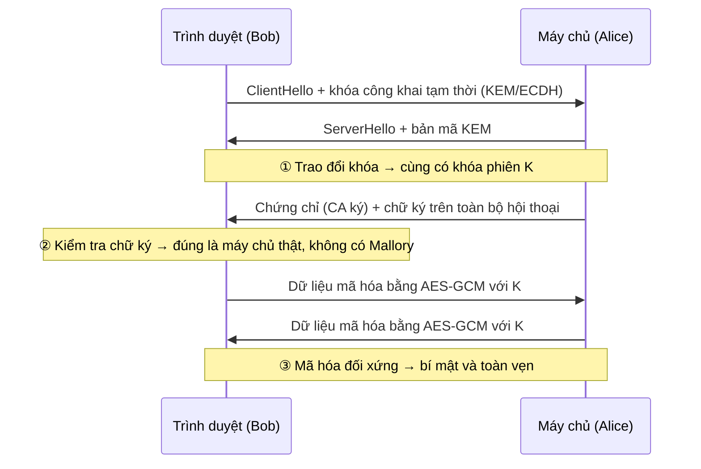

# Alice và Bob: Ý tưởng chung của các bài toán mật mã

> Hầu hết mọi bài toán mật mã đều được kể bằng cùng một câu chuyện: **Alice muốn liên lạc với Bob qua một kênh không an toàn, trong khi kẻ xấu đang theo dõi.** Tài liệu này giải thích câu chuyện đó, các mục tiêu cần đạt, các công cụ giải quyết, và vị trí của mật mã hậu lượng tử (như HQC) trong bức tranh chung.
>
> Đọc tiếp: [PQC_Overview.md](PQC_Overview.md) → [Tim_hieu_HQC.md](Tim_hieu_HQC.md) → [HQC_Luong_hoat_dong.md](HQC_Luong_hoat_dong.md).

---

## Mục lục

1. [Câu chuyện gốc](#1-câu-chuyện-gốc)
2. [Dàn nhân vật](#2-dàn-nhân-vật)
3. [Bốn mục tiêu của mật mã](#3-bốn-mục-tiêu-của-mật-mã)
4. [Kẻ tấn công mạnh đến đâu?](#4-kẻ-tấn-công-mạnh-đến-đâu)
5. [Bài toán 1: Giữ bí mật khi đã có chung khóa (mật mã đối xứng)](#5-bài-toán-1-giữ-bí-mật-khi-đã-có-chung-khóa-mật-mã-đối-xứng)
6. [Bài toán 2: Làm sao có chung khóa? (trao đổi khóa)](#6-bài-toán-2-làm-sao-có-chung-khóa-trao-đổi-khóa)
7. [Bài toán 3: Mã hóa khóa công khai và KEM](#7-bài-toán-3-mã-hóa-khóa-công-khai-và-kem)
8. [Bài toán 4: Chứng minh "tôi là Alice" (chữ ký số)](#8-bài-toán-4-chứng-minh-tôi-là-alice-chữ-ký-số)
9. [Bài toán 5: Kẻ đứng giữa và hạ tầng khóa công khai](#9-bài-toán-5-kẻ-đứng-giữa-và-hạ-tầng-khóa-công-khai)
10. [Ghép tất cả lại: một phiên HTTPS](#10-ghép-tất-cả-lại-một-phiên-https)
11. [Bài toán khó: nền móng của mọi thứ](#11-bài-toán-khó-nền-móng-của-mọi-thứ)
12. [Máy tính lượng tử thay đổi điều gì?](#12-máy-tính-lượng-tử-thay-đổi-điều-gì)
13. [Tóm tắt](#13-tóm-tắt)

---

## 1. Câu chuyện gốc

```
   Alice ─────────────── kênh công khai (Internet, sóng radio...) ─────────────── Bob
                                     ▲
                                     │ nghe lén, sửa đổi, giả mạo
                                    Eve / Mallory
```

- Alice và Bob muốn trao đổi thông tin.
- Kênh truyền **không an toàn**: mọi thứ gửi đi đều có thể bị người khác **đọc**, **sửa** hoặc **giả mạo**.
- Alice và Bob **không thể gặp nhau trực tiếp** để thống nhất bí mật trước (ví dụ: bạn truy cập một website lần đầu).

**Câu hỏi trung tâm của mật mã:** Làm sao để Alice và Bob liên lạc an toàn khi mọi thứ họ gửi đều bị người khác nhìn thấy?

Hai cái tên Alice và Bob xuất hiện lần đầu trong bài báo giới thiệu RSA của Rivest, Shamir và Adleman (1978), thay cho cách viết khô khan "A gửi cho B". Từ đó chúng trở thành quy ước chung trong mọi tài liệu mật mã.

---

## 2. Dàn nhân vật

| Nhân vật | Vai trò | Khả năng |
|---|---|---|
| **Alice** | Người gửi (hoặc người khởi tạo) | Trung thực |
| **Bob** | Người nhận | Trung thực |
| **Eve** (*eavesdropper*) | Kẻ nghe lén **thụ động** | Đọc được mọi thứ trên kênh, nhưng không sửa |
| **Mallory** (*malicious*) | Kẻ tấn công **chủ động** | Đọc, sửa, chặn, chèn, phát lại tin nhắn; giả làm Alice hoặc Bob |
| **Trent** (*trusted*) | Bên thứ ba đáng tin cậy | Ví dụ: tổ chức cấp chứng chỉ (CA) |
| **Carol, Dave** | Người tham gia thêm | Dùng trong giao thức nhiều bên |

Trong các tài liệu HQC trước đó: **Alice** là người tạo khóa và nhận bản mã, **Bob** là người đóng gói khóa và gửi bản mã.

---

## 3. Bốn mục tiêu của mật mã

| Mục tiêu | Câu hỏi | Mối đe dọa | Công cụ |
|---|---|---|---|
| **Bí mật** (Confidentiality) | Chỉ Bob đọc được tin? | Eve nghe lén | Mã hóa: AES, KEM (ML-KEM, HQC) |
| **Toàn vẹn** (Integrity) | Tin có bị sửa trên đường đi? | Mallory sửa nội dung | MAC, mã hóa có xác thực (AES-GCM), hàm băm |
| **Xác thực** (Authentication) | Có đúng là Alice gửi? | Mallory giả danh Alice | MAC, chữ ký số, chứng chỉ |
| **Chống chối bỏ** (Non-repudiation) | Alice có chối được là đã gửi? | Alice nói dối sau này | Chữ ký số (không dùng MAC được, vì Bob cũng có khóa MAC) |

Ví dụ trong đời sống:
- **Bí mật:** không ai khác đọc được tin nhắn Zalo hay Signal của bạn.
- **Toàn vẹn:** số tiền chuyển khoản không bị đổi từ 100 nghìn thành 10 triệu trên đường truyền.
- **Xác thực:** website ngân hàng bạn đang mở đúng là của ngân hàng thật.
- **Chống chối bỏ:** hợp đồng điện tử đã ký thì không thể nói "tôi không ký".

---

## 4. Kẻ tấn công mạnh đến đâu?

### 4.1. Nguyên lý Kerckhoffs (1883)

> **Hệ mật phải an toàn ngay cả khi kẻ tấn công biết toàn bộ thuật toán. Chỉ có khóa là bí mật.**

Vì vậy AES, RSA, HQC... đều được **công bố công khai**: cả thế giới cùng phân tích, và thuật toán nào trụ vững sau nhiều năm mới được tin dùng. Giấu thuật toán ("security through obscurity") không được coi là an toàn.

### 4.2. Các mức tấn công (từ yếu đến mạnh)

| Mô hình | Kẻ tấn công có gì | Ví dụ |
|---|---|---|
| Chỉ có bản mã | Một số bản mã | Eve nghe lén Wi-Fi |
| Biết bản rõ | Vài cặp (bản rõ, bản mã) | Biết header HTTP luôn bắt đầu bằng `GET /` |
| Chọn bản rõ (**CPA**) | Tự chọn bản rõ và nhận bản mã | Với khóa công khai, ai cũng tự mã hóa được |
| Chọn bản mã (**CCA**) | Gửi bản mã tùy ý và quan sát kết quả giải mã | Mallory gửi bản mã giả tới máy chủ và xem phản ứng |

Các hệ mật hiện đại phải chịu được mức mạnh nhất. Tiêu chuẩn **IND-CCA2** nghĩa là: dù được gửi bản mã tùy ý để Bob giải mã (trừ bản mã mục tiêu), kẻ tấn công vẫn **không phân biệt được** bản mã mục tiêu là của thông điệp nào trong hai thông điệp do họ chọn.

HQC đạt IND-CCA2 nhờ biến đổi Fujisaki-Okamoto và **từ chối ngầm** (xem [HQC_Luong_hoat_dong.md](HQC_Luong_hoat_dong.md#7-các-nhánh-lỗi-và-từ-chối)).

### 4.3. "An toàn" nghĩa là gì?

Không phải "không thể phá", mà là **"phá cần quá nhiều tài nguyên"**:

| Mức an toàn | Số phép tính cần để phá | Hình dung |
|---|---|---|
| 80 bit | 2⁸⁰ | Đã không còn đủ an toàn |
| **128 bit** | 2¹²⁸ ≈ 3,4 × 10³⁸ | Mọi máy tính trên Trái Đất chạy hàng tỷ tỷ năm |
| 256 bit | 2²⁵⁶ | Vượt xa số nguyên tử trong vũ trụ quan sát được (~2²⁶⁶) |

---

## 5. Bài toán 1: Giữ bí mật khi đã có chung khóa (mật mã đối xứng)

**Giả sử** Alice và Bob **đã có chung** một khóa bí mật `K`:

```
Alice:  c = Enc(K, m)     ──── c ────►     Bob:  m = Dec(K, c)
                                ▲
                          Eve chỉ thấy c, không có K
```

- **Cùng một khóa** để mã hóa và giải mã, nên gọi là **đối xứng**.
- Thuật toán tiêu biểu: **AES** (chuẩn từ 2001), **ChaCha20**.
- Chế độ hiện đại như **AES-GCM**, **ChaCha20-Poly1305** cung cấp cùng lúc **bí mật + toàn vẹn** (mã hóa có xác thực, AEAD).
- **Rất nhanh**: hàng GB/giây trên CPU hiện đại, nên dùng để mã hóa **dữ liệu thật** (video, file, trang web).

Ví dụ lịch sử đơn giản nhất: **mã Caesar**, dịch mỗi chữ cái đi `K` vị trí (K = 3: `HELLO` → `KHOOR`). Mã này dễ phá vì chỉ có 25 khóa, nhưng ý tưởng giống hệt: **ai có khóa thì giải được**.

**Vấn đề còn lại:** Làm sao Alice và Bob có chung `K` ngay từ đầu, khi họ chưa từng gặp nhau và mọi thứ gửi qua mạng đều bị Eve nhìn thấy? Đây là **bài toán phân phối khóa**, và trong hàng nghìn năm nó được xem là không thể giải quyết.

---

## 6. Bài toán 2: Làm sao có chung khóa? (trao đổi khóa)

### 6.1. Phép ẩn dụ: hộp và hai ổ khóa

1. Alice bỏ thư vào hộp, khóa bằng **ổ khóa A** của mình, rồi gửi đi.
2. Bob nhận hộp, khóa thêm **ổ khóa B** của mình, rồi gửi lại.
3. Alice mở **ổ A**, gửi lại hộp lần nữa (giờ chỉ còn ổ B).
4. Bob mở **ổ B** và đọc thư.

Hộp đi qua kênh công khai **3 lần**, nhưng lần nào cũng có ít nhất một ổ khóa. Hai người **không cần chia sẻ chìa khóa nào** từ trước. Đây là trực giác cho thấy bài toán phân phối khóa **có thể giải được**.

### 6.2. Diffie–Hellman (1976): lời giải toán học đầu tiên

Thống nhất công khai: số nguyên tố `p` và phần tử sinh `g`.

| Alice | Kênh công khai | Bob |
|---|---|---|
| Chọn bí mật `a` | | Chọn bí mật `b` |
| Tính `A = gᵃ mod p` | `A` →  | |
| | ← `B` | Tính `B = gᵇ mod p` |
| Tính `Bᵃ = gᵃᵇ mod p` | | Tính `Aᵇ = gᵃᵇ mod p` |

Cả hai có chung `gᵃᵇ mod p`. Eve thấy `p, g, A, B` nhưng muốn tìm `a` từ `A = gᵃ mod p` thì phải giải **bài toán logarit rời rạc**, rất khó khi `p` đủ lớn.

**Ví dụ số nhỏ** (`p = 23`, `g = 5`):

| | Alice (`a = 6`) | Bob (`b = 15`) |
|---|---|---|
| Gửi công khai | `A = 5⁶ mod 23 = 8` | `B = 5¹⁵ mod 23 = 19` |
| Khóa chung | `19⁶ mod 23 = 2` | `8¹⁵ mod 23 = 2` ✓ |

Bản hiện đại dùng **đường cong elliptic** (ECDH, X25519), cho khóa ngắn hơn với cùng mức an toàn.

### 6.3. Ý tưởng chung đằng sau: hàm một chiều

| Chiều dễ | Chiều khó |
|---|---|
| Tính `gᵃ mod p` từ `a` | Tìm `a` từ `gᵃ mod p` |
| Nhân `p × q` | Phân tích `n` thành `p × q` |
| Tính `s = x + h·y` từ vector thưa `x, y` (HQC) | Tìm `x, y` thưa từ `(h, s)` |

**Mọi hệ mật khóa công khai đều xây trên một "hàm một chiều"**: dễ tính theo chiều thuận, cực khó tính ngược nếu không có thông tin bí mật (gọi là **cửa sập**, *trapdoor*).

---

## 7. Bài toán 3: Mã hóa khóa công khai và KEM

### 7.1. Ý tưởng: hộp thư có khe

Bob có một **hộp thư khóa sẵn** đặt ngoài đường:
- **Khe thư (khóa công khai):** ai cũng bỏ thư vào được.
- **Chìa khóa (khóa bí mật):** chỉ Bob mở hộp lấy thư ra được.

```
Bob:   (pk, sk) ← KeyGen()          công bố pk, giữ sk
Alice: c = Enc(pk, m)        ─── c ───►    Bob: m = Dec(sk, c)
```

Khác với mật mã đối xứng: **khóa để khóa ≠ khóa để mở**, nên Alice và Bob **không cần bí mật chung từ trước**.

### 7.2. Ví dụ: RSA (1977)

- Bob chọn hai số nguyên tố lớn `p, q`, tính `n = p·q`. Khóa công khai `(n, e)`, khóa bí mật `d`.
- Mã hóa: `c = mᵉ mod n`. Giải mã: `m = cᵈ mod n`.
- Muốn tìm `d` thì phải phân tích `n` ra `p, q`: **bài toán phân tích số nguyên**.

Ví dụ nhỏ: `p = 61, q = 53` → `n = 3233`, `e = 17`, `d = 2753`. Mã hóa `m = 65`: `c = 65¹⁷ mod 3233 = 2790`. Giải mã: `2790²⁷⁵³ mod 3233 = 65` ✓.

### 7.3. Vì sao thực tế dùng KEM?

Mã hóa khóa công khai **chậm** hơn mã hóa đối xứng hàng nghìn lần và chỉ mã hóa được dữ liệu nhỏ. Vì vậy người ta **không** dùng nó để mã hóa dữ liệu thật, mà chỉ để **chuyển một khóa đối xứng**.

**KEM (Key Encapsulation Mechanism)** chuẩn hóa đúng việc đó:

```
Bob:   (pk, sk) ← KeyGen()
Alice: (ct, K) ← Encaps(pk)     ─── ct ───►     Bob: K ← Decaps(sk, ct)
                    │                                    │
                    └──────── cùng khóa K ───────────────┘
                                   │
                    dùng K cho AES-GCM để mã hóa dữ liệu thật
```

Mô hình này gọi là **mã hóa lai (hybrid encryption)**: KEM giải bài toán phân phối khóa, mật mã đối xứng lo phần dữ liệu. Đây chính là chỗ **HQC** và **ML-KEM** đứng.

(Lưu ý: trong các tài liệu HQC trước, vai trò bị đảo: **Alice** tạo khóa và mở gói, **Bob** đóng gói. Tên gọi chỉ là quy ước, cấu trúc giống hệt.)

---

## 8. Bài toán 4: Chứng minh "tôi là Alice" (chữ ký số)

Mã hóa giữ **bí mật**, nhưng không cho biết **ai gửi**. Mallory có thể dùng khóa công khai của Bob để gửi tin giả danh Alice.

**Chữ ký số** là chiều ngược lại của mã hóa khóa công khai:

```
Alice: (pk_A, sk_A) ← KeyGen()           công bố pk_A
Alice: σ = Sign(sk_A, m)      ─── (m, σ) ───►      Bob: Verify(pk_A, m, σ) → đúng/sai
```

| | Mã hóa khóa công khai | Chữ ký số |
|---|---|---|
| Ai dùng khóa bí mật? | Người **nhận** (để mở) | Người **gửi** (để ký) |
| Ai dùng khóa công khai? | Người gửi (để khóa) | Người nhận (để kiểm tra) |
| Bảo đảm | Bí mật | Xác thực, toàn vẹn, chống chối bỏ |
| Ví dụ cổ điển | RSA-OAEP, ECIES | RSA-PSS, ECDSA, Ed25519 |
| Ví dụ hậu lượng tử | ML-KEM, **HQC** | ML-DSA, SLH-DSA, FN-DSA |

Hình dung: chữ ký số giống **con dấu** mà chỉ Alice có, còn ai cũng có **mẫu dấu** để đối chiếu.

---

## 9. Bài toán 5: Kẻ đứng giữa và hạ tầng khóa công khai

### 9.1. Tấn công kẻ đứng giữa (Man-in-the-Middle)

Trao đổi khóa và KEM giả định Bob nhận được **đúng** khóa công khai của Alice. Nếu Mallory chặn được kênh:

```
Alice ── pk_A ──►  Mallory  ── pk_M ──► Bob
Alice ◄── ct_1 ──  Mallory  ◄── ct_2 ── Bob
       khóa K₁ với Mallory       khóa K₂ với Mallory
```

Mallory thay khóa công khai của Alice bằng khóa của mình. Bob tưởng đang nói chuyện với Alice, nhưng thực ra Mallory **giải mã, đọc, sửa, rồi mã hóa lại** mọi tin nhắn ở giữa. Toán học của KEM vẫn đúng, nhưng **khóa công khai không được xác thực**.

### 9.2. Giải pháp: chứng chỉ số và PKI

- Một bên đáng tin cậy (**Trent**, tức tổ chức cấp chứng chỉ, CA) **ký** vào khóa công khai của Alice: "khóa này thuộc về alice.com".
- Bob có sẵn khóa công khai của CA (cài sẵn trong hệ điều hành và trình duyệt), nên **kiểm tra được chữ ký**.
- Mallory không giả được chữ ký của CA, nên không thay được khóa.

Đây là **hạ tầng khóa công khai (PKI)**, nền tảng của biểu tượng ổ khóa 🔒 trên trình duyệt.

Ngoài ra còn các cách khác: so sánh "dấu vân tay" khóa trực tiếp (Signal safety number, SSH fingerprint), hoặc mô hình "web of trust" (PGP).

---

## 10. Ghép tất cả lại: một phiên HTTPS

Khi bạn mở `https://nganhang.vn`, trình duyệt (Bob) và máy chủ (Alice) dùng **tất cả** các công cụ trên trong giao thức **TLS 1.3**:



| Bước | Công cụ | Bài toán được giải |
|---|---|---|
| ① | Trao đổi khóa: X25519, hoặc **lai X25519 + ML-KEM** | Phân phối khóa (bài toán 2, 3) |
| ② | Chữ ký số + chứng chỉ | Xác thực, chống kẻ đứng giữa (bài toán 4, 5) |
| ③ | AES-GCM / ChaCha20-Poly1305 | Bí mật + toàn vẹn dữ liệu (bài toán 1) |

Khóa phiên `K` là **tạm thời**: hết phiên thì xóa. Nhờ vậy, kể cả khi khóa dài hạn của máy chủ bị lộ sau này, dữ liệu cũ vẫn an toàn. Tính chất này gọi là **bí mật chuyển tiếp** (*forward secrecy*).

---

## 11. Bài toán khó: nền móng của mọi thứ

Mọi hệ mật khóa công khai đều dựa trên giả định: **có một bài toán mà không ai giải nhanh được**.

| Bài toán khó | Dùng trong | Máy tính thường | Máy tính lượng tử |
|---|---|---|---|
| Phân tích số nguyên | RSA | Khó | ❌ **Dễ** (Shor) |
| Logarit rời rạc (kể cả trên đường cong elliptic) | DH, ECDH, ECDSA, Ed25519 | Khó | ❌ **Dễ** (Shor) |
| Học có lỗi trên lưới (LWE) | ML-KEM, ML-DSA | Khó | ✅ Vẫn khó |
| **Giải mã mã tuyến tính ngẫu nhiên (Syndrome Decoding)** | **HQC**, Classic McEliece | Khó | ✅ Vẫn khó |
| Tính một chiều của hàm băm | SLH-DSA | Khó | ✅ Vẫn khó (Grover chỉ làm yếu một nửa) |

Một hệ mật chỉ an toàn bằng **bài toán khó mà nó dựa vào**. Khi bài toán đó bị giải (bằng thuật toán mới hoặc máy tính mới), mọi hệ mật xây trên nó sụp đổ cùng lúc.

---

## 12. Máy tính lượng tử thay đổi điều gì?

Câu chuyện Alice–Bob **không đổi**. Chỉ có **Eve và Mallory mạnh hơn**: họ có thể sở hữu máy tính lượng tử.

| Bài toán của Alice và Bob | Công cụ cũ | Bị đe dọa? | Công cụ hậu lượng tử |
|---|---|---|---|
| Mã hóa dữ liệu (đối xứng) | AES-128 | Yếu đi một nửa (Grover) | **AES-256** (giữ nguyên thuật toán) |
| Phân phối khóa | RSA, ECDH | ❌ Bị phá (Shor) | **ML-KEM**, dự phòng **HQC** |
| Chữ ký số | RSA, ECDSA | ❌ Bị phá (Shor) | **ML-DSA**, **SLH-DSA**, FN-DSA |
| Băm | SHA-256 | Gần như không ảnh hưởng | Giữ nguyên hoặc SHA-384 |

Đáng lo nhất là **phân phối khóa**, vì kiểu tấn công **"thu thập bây giờ, giải mã sau"**: Eve ghi lại các phiên trao đổi khóa hôm nay, đợi có máy tính lượng tử thì giải ra khóa phiên và đọc toàn bộ dữ liệu cũ. Vì thế KEM hậu lượng tử như ML-KEM và HQC được triển khai **trước tiên**, thường theo kiểu **lai** (X25519 + ML-KEM) để an toàn nếu một trong hai bị phá.

**HQC trong câu chuyện:**
- Giải bài toán **phân phối khóa** (bài toán 2–3).
- Dựa trên bài toán **giải mã mã ngẫu nhiên**, khác hẳn lưới của ML-KEM. Nếu một ngày lưới bị phá, Alice và Bob vẫn còn HQC.

---

## 13. Tóm tắt

```
                    ┌────────────────────────────────────────────┐
                    │     Alice và Bob trên kênh không an toàn   │
                    └────────────────────────────────────────────┘
                                         │
       ┌──────────────────┬──────────────┼──────────────┬──────────────────┐
       ▼                  ▼              ▼              ▼                  ▼
  Bí mật dữ liệu    Có chung khóa    Xác thực      Chống Mallory      Nền móng
  ──────────────    ─────────────    ────────      ─────────────      ────────
  AES, ChaCha20     DH, RSA, KEM     Chữ ký số     Chứng chỉ, PKI     Bài toán khó
                    (ML-KEM, HQC)    (ML-DSA)                         (một chiều)
```

1. **Mục tiêu:** bí mật, toàn vẹn, xác thực, chống chối bỏ, ngay cả khi kẻ tấn công biết thuật toán và kiểm soát kênh truyền.
2. **Mật mã đối xứng** nhanh nhưng cần **khóa chung từ trước**.
3. **Mật mã khóa công khai** (trao đổi khóa, KEM) giải bài toán **có khóa chung**, dựa trên **hàm một chiều có cửa sập**.
4. **Chữ ký số và chứng chỉ** chống **giả danh** và **kẻ đứng giữa**.
5. Thực tế **kết hợp tất cả**: KEM → khóa phiên → AES-GCM, kèm chữ ký để xác thực.
6. **Máy tính lượng tử** phá các bài toán khó cũ (phân tích số, logarit rời rạc), nên cần **bài toán khó mới** (lưới, mã sửa lỗi, hàm băm). **HQC** là một lời giải cho phần phân phối khóa.

---

*Tài liệu phục vụ học tập.*
