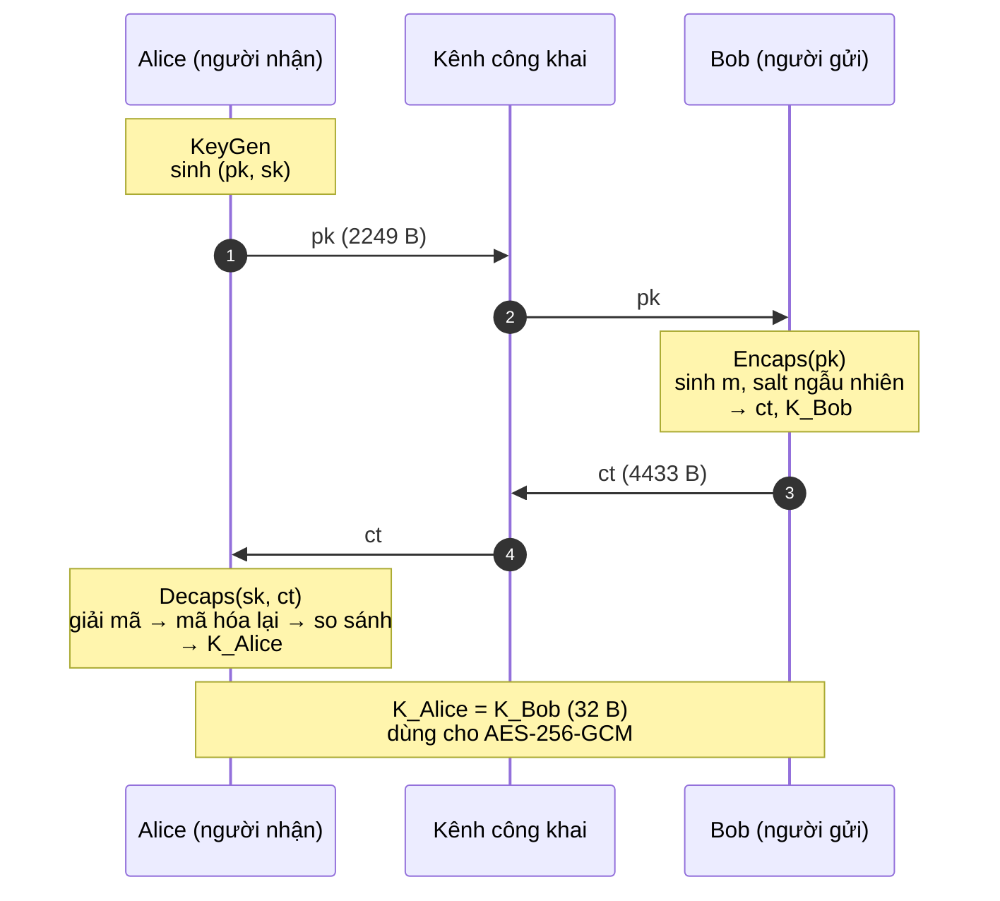
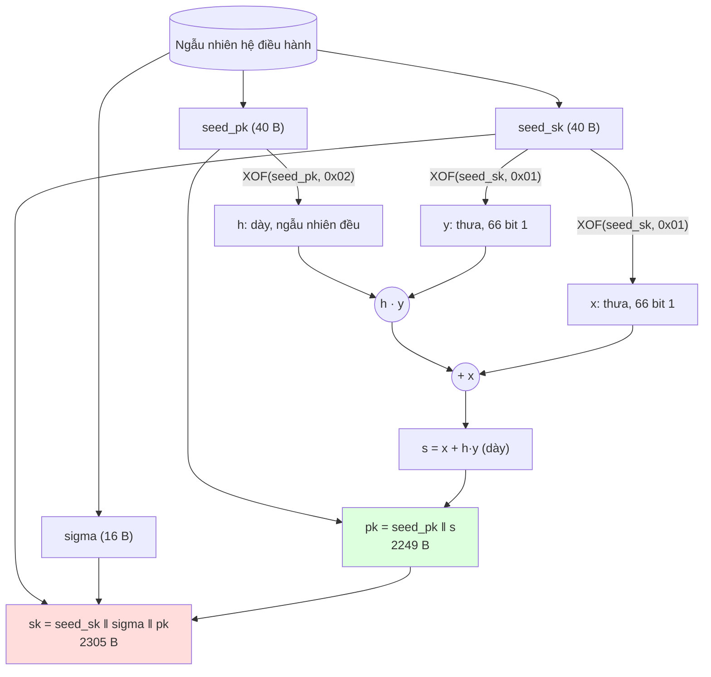
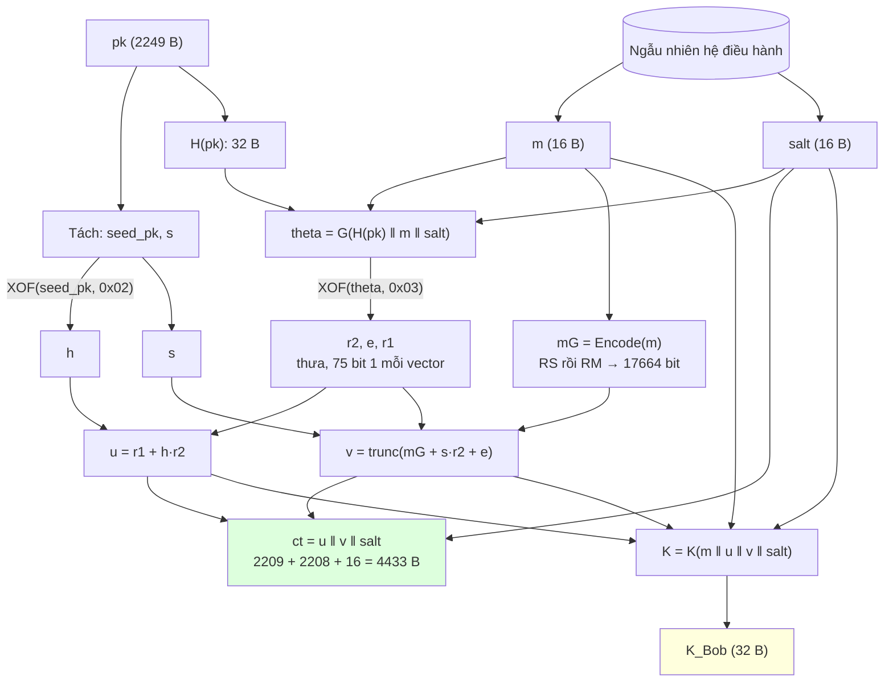
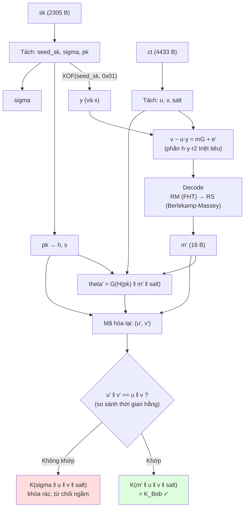
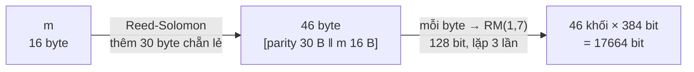
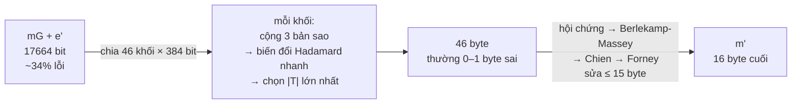
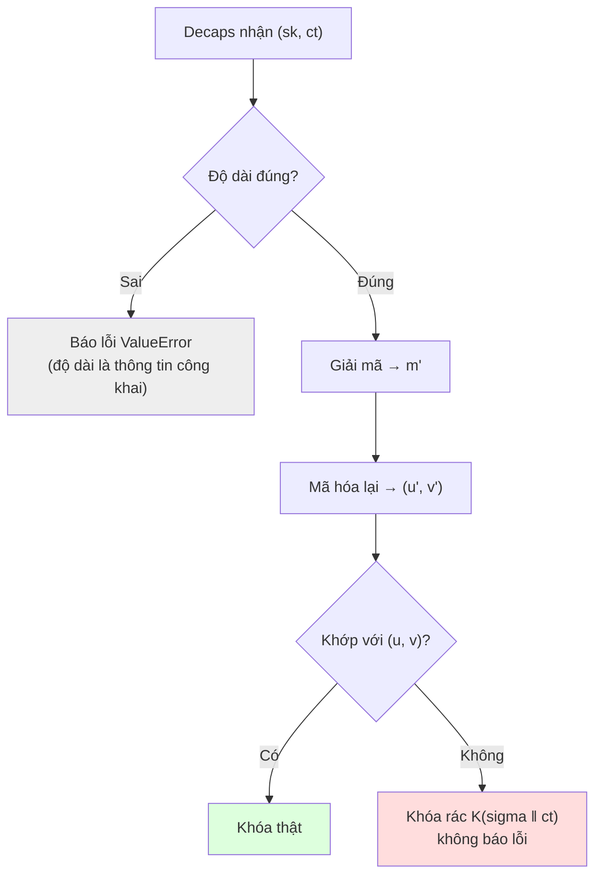

# Luồng hoạt động của thuật toán HQC

> Mô tả **từng bước dữ liệu đi qua** HQC-KEM: từ lúc Alice tạo khóa, Bob đóng gói khóa, đến lúc Alice mở gói khóa. Mọi kích thước tính theo **HQC-128**.
>
> Đọc kèm:
> - [Tim_hieu_HQC.md](Tim_hieu_HQC.md): giải thích trực giác và ví dụ tính tay.
> - [HQC_Post_Quantum_Cryptography.md](HQC_Post_Quantum_Cryptography.md): tham số, an toàn, chuẩn hóa.
> - Mã nguồn: [../Implementation/hqc/](../Implementation/hqc/) (đầy đủ) và [../Implementation/hqc_basic.py](../Implementation/hqc_basic.py) (cơ bản).

---

## Mục lục

1. [Tổng quan ba giai đoạn](#1-tổng-quan-ba-giai-đoạn)
2. [Giai đoạn 0: Thiết lập tham số](#2-giai-đoạn-0-thiết-lập-tham-số)
3. [Giai đoạn 1: KeyGen (Alice)](#3-giai-đoạn-1-keygen-alice)
4. [Giai đoạn 2: Encaps (Bob)](#4-giai-đoạn-2-encaps-bob)
5. [Giai đoạn 3: Decaps (Alice)](#5-giai-đoạn-3-decaps-alice)
6. [Luồng bên trong mã sửa lỗi](#6-luồng-bên-trong-mã-sửa-lỗi)
7. [Các nhánh lỗi và từ chối](#7-các-nhánh-lỗi-và-từ-chối)
8. [Bảng tổng hợp dữ liệu](#8-bảng-tổng-hợp-dữ-liệu)
9. [Ánh xạ sang mã nguồn](#9-ánh-xạ-sang-mã-nguồn)

---

## 1. Tổng quan ba giai đoạn



| Giai đoạn | Ai thực hiện | Đầu vào | Đầu ra | Bao lâu một lần |
|---|---|---|---|---|
| 0. Setup | Chuẩn quy định | Mức an toàn | Bộ tham số | Cố định |
| 1. KeyGen | Alice | Ngẫu nhiên từ hệ điều hành | `pk` (công khai), `sk` (bí mật) | Một lần, dùng lâu dài |
| 2. Encaps | Bob | `pk` | `ct` (gửi đi), `K` (giữ lại) | Mỗi phiên kết nối |
| 3. Decaps | Alice | `sk`, `ct` | `K` | Mỗi phiên kết nối |

**Ý tưởng cốt lõi trong một câu:** Bob giấu một bí mật ngẫu nhiên `m` dưới lớp nhiễu dày mà chỉ khóa bí mật `y` của Alice gỡ được; cả hai sau đó băm `m` ra cùng một khóa chung.

---

## 2. Giai đoạn 0: Thiết lập tham số

Không phải là một bước chạy, mà là các hằng số mà hai bên **đã thống nhất trước**.

| Ký hiệu | HQC-128 | Ý nghĩa |
|---|---|---|
| `n` | 17 669 | Độ dài vector; làm việc trong vành `R = F₂[X]/(Xⁿ − 1)` |
| `n1` | 46 | Độ dài mã Reed-Solomon (số byte) |
| `n2` | 384 | Độ dài mã Reed-Muller nhân bản (bit) cho mỗi byte |
| `n1·n2` | 17 664 | Độ dài mã từ (bit), ≤ n |
| `k` | 16 byte | Độ dài bí mật `m` |
| `δ` | 15 | Số byte sai tối đa mà Reed-Solomon sửa được |
| `w` | 66 | Số bit 1 của khóa bí mật `x`, `y` |
| `wr = we` | 75 | Số bit 1 của nhiễu `r1`, `r2`, `e` |

Ngoài ra cố định:
- **Mã công khai `C`** = Reed-Solomon [46, 16] trên GF(256) ghép Reed-Muller RM(1,7) nhân bản 3 lần.
- **Các hàm băm** `G`, `H`, `K` dựng từ SHAKE256 với byte tách miền khác nhau.

---

## 3. Giai đoạn 1: KeyGen (Alice)

### 3.1. Sơ đồ luồng



### 3.2. Các bước

| Bước | Thao tác | Kết quả |
|---|---|---|
| 1 | Lấy 96 byte ngẫu nhiên an toàn từ hệ điều hành | `seed_sk` (40 B), `seed_pk` (40 B), `sigma` (16 B) |
| 2 | Mở luồng XOF từ `seed_sk`, lấy mẫu hai vector có đúng 66 bit 1 (thứ tự: `y` rồi `x`) | Khóa bí mật `x`, `y` |
| 3 | Mở luồng XOF từ `seed_pk`, đọc ⌈n/8⌉ byte rồi cắt còn n bit | Vector công khai `h` |
| 4 | Tính `s = x + h·y` (XOR của 66 bản xoay vòng của `h`, rồi XOR với `x`) | Vector công khai `s` |
| 5 | Ghép `pk = seed_pk ‖ s` | 40 + 2209 = **2249 B** |
| 6 | Ghép `sk = seed_sk ‖ sigma ‖ pk` | 40 + 16 + 2249 = **2305 B** |

### 3.3. Điểm cần nhớ
- **Chỉ lưu seed, không lưu vector.** `h` được thay bằng `seed_pk`; `x, y` được thay bằng `seed_sk`. Ai có seed thì sinh lại được vector.
- `s` trông ngẫu nhiên (khoảng 50% bit 1). Tìm lại `x, y` từ `(h, s)` là bài toán **QCSD**, rất khó.
- `sigma` chỉ dùng khi **từ chối ngầm** ở Decaps.
- `sk` chứa sẵn `pk` để Decaps không cần thêm tham số.

---

## 4. Giai đoạn 2: Encaps (Bob)

### 4.1. Sơ đồ luồng



### 4.2. Các bước

| Bước | Thao tác | Kết quả |
|---|---|---|
| 1 | Đọc `pk`: tách `seed_pk` và `s`, sinh lại `h` từ `seed_pk` | `h`, `s` |
| 2 | Sinh ngẫu nhiên an toàn | `m` (16 B), `salt` (16 B) |
| 3 | Băm khóa công khai | `H(pk)` (32 B) |
| 4 | Tính seed nhiễu | `theta = G(H(pk) ‖ m ‖ salt)` (32 B) |
| 5 | Mở luồng XOF từ `theta`, lấy mẫu theo thứ tự cố định | `r2`, `e`, `r1` (mỗi vector 75 bit 1) |
| 6 | `u = r1 + h·r2` | 17 669 bit |
| 7 | Mã hóa `m` bằng mã công khai: 16 B → RS → 46 B → RM ×3 → 17 664 bit | `mG` |
| 8 | `v = mG + s·r2 + e`, cắt còn 17 664 bit | `v` |
| 9 | Ghép `ct = u ‖ v ‖ salt` | **4433 B**, gửi cho Alice |
| 10 | Tính khóa chung `K(m ‖ u ‖ v ‖ salt)` | **32 B**, Bob giữ |

### 4.3. Điểm cần nhớ
- **Nhiễu được tính ra từ `m`** (bước 4–5), không sinh ngẫu nhiên độc lập. Nhờ vậy Alice có thể **mã hóa lại** để kiểm tra. Đây là biến đổi **Fujisaki-Okamoto**.
- `H(pk)` gắn bản mã với đúng người nhận; `salt` chống kẻ tấn công tính trước các giá trị `m` "xấu".
- Phần `s·r2` dày (khoảng 50% bit 1) che kín `mG`. Không có khóa thì không đọc được gì.
- Bob **không biết** Alice có giải mã thành công hay không; xác suất thất bại < 2⁻¹²⁸.

---

## 5. Giai đoạn 3: Decaps (Alice)

### 5.1. Sơ đồ luồng



### 5.2. Các bước

| Bước | Thao tác | Kết quả |
|---|---|---|
| 1 | Kiểm tra độ dài `sk` = 2305 B và `ct` = 4433 B (thông tin công khai, được phép báo lỗi) | Hợp lệ hoặc dừng |
| 2 | Tách `sk` thành `seed_sk`, `sigma`, `pk`; tách `ct` thành `u`, `v`, `salt` | Các thành phần |
| 3 | Sinh lại `y` từ `seed_sk`; sinh lại `h` từ `pk` | `y`, `h`, `s` |
| 4 | **Gỡ lớp che giấu:** tính `v − u·y` | `mG + e'` với `e' = x·r2 − r1·y + e` |
| 5 | **Sửa lỗi:** giải mã RM rồi RS (xem mục 6) | Ứng viên `m'` |
| 6 | Tính lại `theta' = G(H(pk) ‖ m' ‖ salt)` | Seed nhiễu |
| 7 | **Mã hóa lại** `m'` với nhiễu sinh từ `theta'` | `(u', v')` |
| 8 | So sánh `u' ‖ v'` với `u ‖ v` theo kiểu thời gian hằng | Khớp / không khớp |
| 9 | Tính cả hai khóa `K(m' ‖ …)` và `K(sigma ‖ …)`, chọn một theo kết quả bước 8 | **32 B** |

### 5.3. Vì sao bước 4 gỡ được lớp che giấu?

```
v − u·y = (mG + s·r2 + e) − (r1 + h·r2)·y
        = mG + (x + h·y)·r2 + e − r1·y − h·r2·y
        = mG + x·r2 + h·y·r2 + e − r1·y − h·r2·y
        = mG + x·r2 − r1·y + e                     ← h·y·r2 triệt tiêu (R giao hoán)
             └────────── e' ──────────┘
```

| Đại lượng | Tỷ lệ bit 1 (HQC-128) | Giải mã được? |
|---|---|---|
| `v − mG` khi **không** có `y` | ≈ 50% | Không: nhiễu thuần túy |
| `e'` khi **có** `y` | ≈ 34% | Có: mã RM-RS sửa được |

### 5.4. Điểm cần nhớ
- Bước 5 chỉ **đề xuất** `m'`; bước 7–8 mới **xác nhận**. Cờ "giải mã thành công" của RS bị bỏ qua.
- Mã hóa lại chặn mọi bản mã **tự chế** hoặc **bị sửa**, kể cả khi sửa 1 bit mà vẫn giải mã ra đúng `m`.
- Không bao giờ báo "bản mã sai": luôn trả về 32 byte trông ngẫu nhiên.
- Decaps chậm nhất trong ba giai đoạn vì gồm cả giải mã **và** mã hóa lại.

---

## 6. Luồng bên trong mã sửa lỗi

### 6.1. Mã hóa (Encode) – trong Encaps bước 7



### 6.2. Giải mã (Decode) – trong Decaps bước 5



| Tầng | Đầu vào | Đầu ra | Khả năng |
|---|---|---|---|
| Reed-Muller (mã trong) | 384 bit/khối, khoảng 130 bit lỗi | 1 byte/khối | Giải mã hợp lý cực đại, vượt bán kính đảm bảo 95 bit |
| Reed-Solomon (mã ngoài) | 46 byte, vài byte có thể sai | 16 byte `m'` | Sửa tối đa δ = 15 byte sai |

---

## 7. Các nhánh lỗi và từ chối



| Tình huống | Giải mã ra | Mã hóa lại khớp? | Kết quả | Hai bên có cùng khóa? |
|---|---|---|---|---|
| Bản mã hợp lệ | `m' = m` | Có | Khóa thật | ✓ |
| Bản mã bị sửa trên đường truyền | Đúng hoặc sai | Không | Khóa rác | ✗ |
| Kẻ tấn công tự chế bản mã | Rác | Không | Khóa rác | ✗ |
| Dùng sai khóa bí mật | Rác | Không | Khóa rác | ✗ |
| Nhiễu quá lớn tự nhiên (< 2⁻¹²⁸) | `m' ≠ m` | Không | Khóa rác | ✗ |
| Độ dài `sk`/`ct` sai | (không chạy) | (không chạy) | Báo lỗi | ✗ |

Khi hai bên có khóa khác nhau, lỗi chỉ lộ ra **ở tầng sau** (ví dụ tag AES-GCM không hợp lệ), giống hệt mọi lỗi kết nối khác. Kẻ tấn công không học được gì về khóa bí mật.

---

## 8. Bảng tổng hợp dữ liệu

### 8.1. Giá trị bí mật và công khai

| Dữ liệu | Kích thước | Ai biết | Vòng đời |
|---|---|---|---|
| `seed_sk`, `x`, `y` | 40 B / 66 bit 1 mỗi vector | Chỉ Alice | Lâu dài |
| `sigma` | 16 B | Chỉ Alice | Lâu dài |
| `seed_pk`, `h`, `s` | 40 B / 17 669 bit | Mọi người | Lâu dài |
| `m` | 16 B | Bob; Alice sau khi giải mã | Một phiên |
| `salt` | 16 B | Mọi người (nằm trong `ct`) | Một phiên |
| `theta`, `r1`, `r2`, `e` | 32 B / 75 bit 1 mỗi vector | Bob; Alice sau khi tính lại | Một phiên |
| `u`, `v` | 2209 B + 2208 B | Mọi người (nằm trong `ct`) | Một phiên |
| `K` | 32 B | Alice và Bob | Một phiên |

### 8.2. Kích thước theo bộ tham số

| Bộ tham số | pk | sk | ct | K |
|---|---|---|---|---|
| HQC-128 | 2 249 | 2 305 | 4 433 | 32 |
| HQC-192 | 4 522 | 4 586 | 8 978 | 32 |
| HQC-256 | 7 245 | 7 317 | 14 421 | 32 |

### 8.3. Các lần dùng hàm băm

| Hàm | Đầu vào | Đầu ra | Dùng ở |
|---|---|---|---|
| XOF (0x01) | `seed_sk` | `y`, `x` | KeyGen, Decaps |
| XOF (0x02) | `seed_pk` | `h` | KeyGen, Encaps, Decaps |
| XOF (0x03) | `theta` | `r2`, `e`, `r1` | Encaps, Decaps (mã hóa lại) |
| `H` (0x06) | `pk` | 32 B | Encaps, Decaps |
| `G` (0x04) | `H(pk) ‖ m ‖ salt` | `theta` | Encaps, Decaps |
| `K` (0x05) | `m ‖ u ‖ v ‖ salt` hoặc `sigma ‖ u ‖ v ‖ salt` | Khóa chung 32 B | Encaps, Decaps |

---

## 9. Ánh xạ sang mã nguồn

| Bước trong tài liệu | Bản đầy đủ `hqc/` | Bản cơ bản `hqc_basic.py` |
|---|---|---|
| Tham số (mục 2) | [params.py](../Implementation/hqc/params.py) | Hằng số `N, K, REP, W, WR, WE` |
| Sinh vector từ seed | [xof.py](../Implementation/hqc/xof.py) `sample_dense`, `sample_fixed_weight` | `random_dense`, `random_sparse`, `_sparse_from` |
| Nhân trong vành R | [gf2x.py](../Implementation/hqc/gf2x.py) `mul_sparse` | `rotate`, `multiply` |
| KeyGen (mục 3) | [kem.py](../Implementation/hqc/kem.py) `keygen` → [pke.py](../Implementation/hqc/pke.py) `keygen` | `keygen` |
| Encaps (mục 4) | [kem.py](../Implementation/hqc/kem.py) `encaps` → [pke.py](../Implementation/hqc/pke.py) `encrypt` | `encaps` → `encrypt` |
| Decaps (mục 5) | [kem.py](../Implementation/hqc/kem.py) `decaps` → [pke.py](../Implementation/hqc/pke.py) `decrypt` | `decaps` → `decrypt` |
| Mã sửa lỗi (mục 6) | [code.py](../Implementation/hqc/code.py), [reed_muller.py](../Implementation/hqc/reed_muller.py), [reed_solomon.py](../Implementation/hqc/reed_solomon.py) | Mã lặp ×31: `encode`, `decode` |
| Hàm băm (mục 8.3) | [xof.py](../Implementation/hqc/xof.py) `shake`, [kem.py](../Implementation/hqc/kem.py) `_G`, `_H`, `_K` | `_hash` (SHA-256, không tách miền) |

Chạy thử để thấy toàn bộ luồng:
```bash
cd Project/Implementation
python demo.py          # bản đầy đủ, HQC-128
python hqc_basic.py     # bản cơ bản, in từng bước
```

---

*Ghi chú: kích thước và tham số theo đặc tả HQC Round 4. Định dạng hàm băm và cách sinh ngẫu nhiên trong tài liệu khớp với cài đặt học tập ở thư mục `Implementation`, có thể khác chi tiết với chuẩn FIPS cuối cùng của NIST.*
